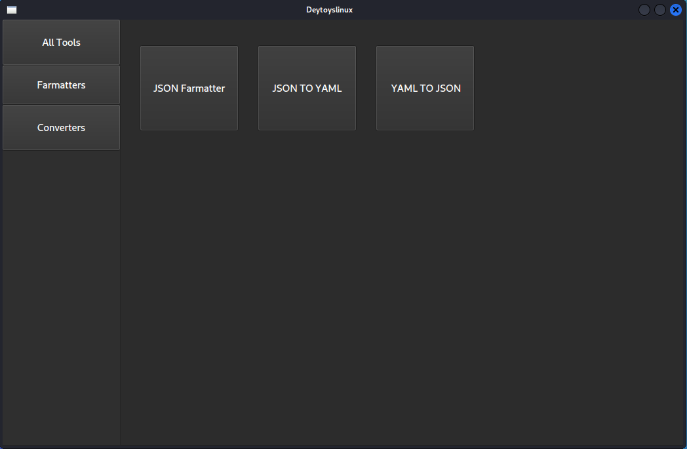
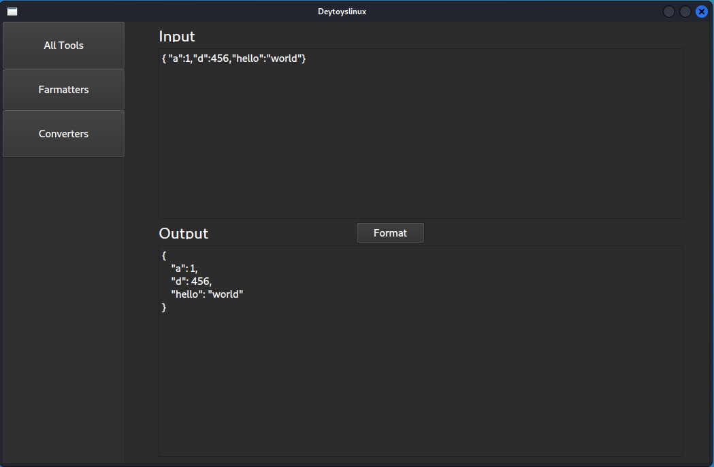

# DevToysLinux

DevToys for linux

Note : DevToysLinux is currently in development.

## How to install

```sh
git clone https://github.com/jakbin/DevToysLinux.git

cd DevToysLinux

python3 setup.py install --user
```

## How to run
```
devtoys
```

## Tools are available :

- Converters
    - Json > Yaml
    - Yaml > Json
- Formatters
    - Json

## Screensots :




